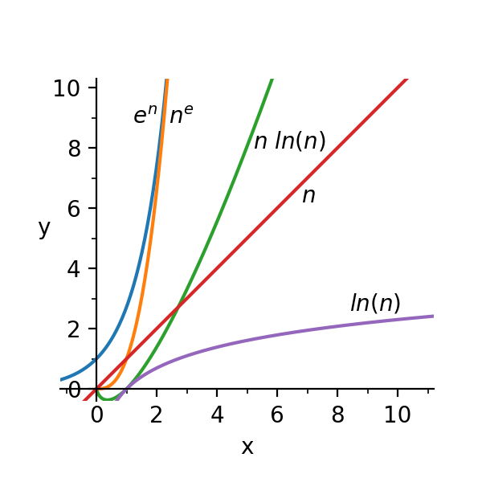

# 【45】限界を知る{#e45}

グレッグ・コルヴィン（Greg Colvin）

> 身の程を忘れないことだ
>
> 
&mdash;&mdash;ダーティ・ハリー

　人間の持つリソースは限られています。たとえば時間とお金です。まず、日々の業務には時間とお金が必要です。時代に遅れないよう知識や技術を磨き、ツールを常に最新に保つにも時間とお金は必要です。知性と能力を高めれば、また長時間、集中して働けば、それだけ大きな成果は得られるかもしれません。ツールの機能、マシンの性能が向上することによって得られる成果が大きくなるということもあるでしょう。それでもやはり、リソースに限界があるということを常に忘れず、その限界を尊重する必要があるのです。

　「限界を尊重する」というのは具体的にどういうことでしょうか。それはまず、「限界が具体的にどのくらいかを知る」ということです。自分自身の限界、プロジェクトチームのメンバーたちの限界、予算の限界、自分の持つ時間、ハードウェア、ツールの限界などが具体的にどのくらいなのかをよく知らねばなりません。特にソフトウェア技術者の場合、自分の使うシステムの、データ構造、アルゴリズム、アーキテクチャ、性能等の特性の「空間と時間の複雑性（Time and Space Complexity）」を知ることが重要になります。ソフトウェアとハードウェアの最適な組み合わせを見つけて、両者の力を最大限に引き出すのです。

　「空間と時間の複雑性」は、 O(f(n)) という関数で表せます。この場合、n が入力のサイズだとすると、この関数で求められるのは、n が無限大に向かって大きくなっていく時に必要な漸近空間、または漸近時間ということになります。f(n) の重要な複雑性クラスには、 ln(n)、n、n ln(n)、n^e^、e^n^ があります。これらの関数をグラフにしてみると、n が大きくなるほど、O(ln(n)) は、O(n) や O(n ln(n)) に比べてはるかに小さくなっていくということがわかります。Sean Parent が指摘するとおり、達成可能な n に関して言えば、すべての複雑性クラスは、ほぼ一定、ほぼ線形、ほぼ無限ということになります。

　複雑性解析においては、抽象マシンによる評価が行われますが、ソフトウェアが動作するのは、現実の具体的なマシンです。近年のコンピュータシステムは、物理マシンと仮想マシンの階層構造になっており、そこには言語ランタイム、OS、CPU、キャッシュメモリ、RAM、ディスクドライブ、ネットワークなどが含まれます。次ページの表は、ネットワークに接続される一般的なサーバのランダムアクセス時間と容量についてまとめたものです。

|                  | アクセス時間 |      容量 |
|:-----------------|-------------:|----------:|
| レジスタ         |     &lt;1 ns |      64 b |
| キャッシュライン |              |      64 B |
| &nbsp;&nbsp;&nbsp;&nbsp;L1キャッシュ | 1ns | 64 KB |
| &nbsp;&nbsp;&nbsp;&nbsp;L2キャッシュ | 4ns | 8 MB |
| RAM              |         20ns |     32 GB |
| ディスク         |         10ms |     10 TB |
| LAN              |         20ms |  &gt;1 PT |
| インターネット   |        100ms | &gt; 1 ZB |

　表を見てわかるのは、速度も容量も、項目によって桁がいくつも違っているということです。システムのあらゆるレベルで、キャッシュと先読みが頻繁に行われ、それによって、この違いはかなり隠蔽されてはいるのですが、キャッシュや先読みが有効なのは、アクセスが予測できる場合だけです。キャッシュしたデータが結局使われないような場面が多くなると、システムは急激に遅くなってしまいます。たとえば、ハードディスクのすべてのバイトをランダムに調べていく処理をしたとすると、完了までに 32 年くらいかかることになります。RAM のすべてのバイトをランダムに調べるという処理でも、11 分くらいはかかります。ランダムアクセスは予測ができないからです。では予測ができる処理とはどういうものでしょうか。システムによっても違いますが、アクセスしたばかりのデータへの再アクセスや、データへのシーケンシャルなアクセスなどは、通常、予測可能です。

　キャッシュがどの程度有効に活かせるかは、アルゴリズムやデータ構造によっても違ってきます。例をいくつかあげておきます。

* 線形探索では、先読みを有効に活かせるが、O(n) 比較が必要。
* ソートされた配列の二分探索には、O(log(n)) 比較のみ必要。
* van Emde Boas 木検索は O(log(n)) で、キャッシュに依存しないアルゴリズムである。

　ただ、結局どのアルゴリズムやデータ構造を選ぶかは、実際に試してみて処理時間を計測するという方法で決めるしかないことも多いでしょう。下の表は、上記 3 つのアルゴリズムで 64 ビット整数の配列を検索した場合の所要時間を示しています。ただし、これはあくまで私のコンピュータで得られた結果です。

|      |    線形 |  二分 |   vEB |
|-----:|--------:|------:|------:|
|    8 |    50ns |  90ns |  40ns |
|   64 |   180ns | 150ns |  70ns |
|  512 |  1200ns | 230ns | 100ns |
| 4096 | 17000ns | 320ns | 160ns |

この結果に関しては以下のことが言えます。

* 線形探索は、配列が小さい場合には比較的優位だが、配列が大きくなると急速に不利になる。
* van Emde Boas 木検索は、配列が大きくなっても、さほど所要時間が増えない。アクセスパターンが予測可能なためと思われる。

　「金を払う者が何でも好きに選べばよい」ということわざもあります。
